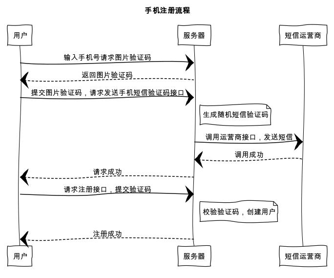

## 手机注册
手机注册流程



wxml 部分
```html
<template>
  <form bindsubmit="submit">
    <!-- 手机号 -->
    <input type="number" placeholder="请输入手机号" disabled="{{ phoneDisabled }}" @input="bindPhoneInput"/>
    <view wx:if="{{ errors.phone }}">{{ errors.phone[0] }}</view>
    <button @tap="tapCaptchaCode">获取验证码</button>

    <!-- 图片验证码弹窗 -->
    <view hidden="{{ captchaModalHidden }}">
      <view wx:if="{{ errors.captchaValue }}">{{ errors.captchaValue[0] }}</view>
      <input placeholder="图片验证码" @input="bindCaptchaCodeInput"/>
      <image src="{{ captcha.imageContent }}" @tap="tapCaptchaCode"/>
      <button @tap="sendVerificationCode">确认</button>
    </view>

    <!-- 短信验证码  -->
    <input placeholder="请输入短信验证码" name="verification_code" />
    <view wx:if="{{ errors.verification_code }}">{{ errors.verification_code[0] }}</view>

    <!-- 姓名 -->
    <input placeholder="请输入姓名" name="name" />
    <view wx:if="{{ errors.name }}">{{ errors.name[0] }}</view>

    <!-- 密码 -->
    <input type="password" placeholder="请输入密码" name="password" />
    <view wx:if="{{ errors.password }}">{{ errors.password[0] }}</view>

    <!-- 注册按钮 -->
    <button formType="submit">注册</button>
  </form>
</template>
```
js 部分
```javascript
import wepy from 'wepy'
import api from '@/utils/api'

export default class Register extends wepy.page {
  data = {
    // 手机号
    phone: null,
    // 手机号 input 是否 disabled
    phoneDisabled: false,
    // 图片验证码弹窗是否隐藏
    captchaModalHidden: true,
    // 用户输入的（图片）验证码
    captchaValue: null,
    // 图片验证码 key 及过期时间
    captcha: {},
    // 短信验证码 key 及过期时间
    verificationCode: {},
    // 错误
    errors: {}
  }
  // 重置注册流程，初始化 data 数据
  resetRegister() {
    this.phoneDisabled = false
    this.captchaModalHidden = true
    this.captcha = {}
    this.verificationCode = {}
    this.errors = {}
  }
  // 获取图片验证码
  async getCaptchaCode() {
    this.errors.phone = null

    // 判断手机号是否正确
    if (!(/^1[34578]\d{9}$/.test(this.phone))) {
      this.errors.phone = ['请输入正确的手机号']
      this.$apply()
      return false
    }

    try {
      // 调用请求图片验证码接口，参数为手机号
      let captchaResponse = await api.request({
        url: 'captchas',
        method: 'POST',
        data: {
          phone: this.phone
        }
      })

      // 记录图片验证码 key 和过期时间，打开弹窗
      if (captchaResponse.statusCode === 201) {
        this.captcha = {
          key: captchaResponse.data.captcha_key,
          imageContent: captchaResponse.data.captcha_image_content,
          expiredAt: Date.parse(captchaResponse.data.expired_at)
        }

        // 打开弹窗
        this.captchaModalHidden = false
        this.$apply()
      }

      // 表单错误
      if (captchaResponse.statusCode === 422) {
        this.errors = captchaResponse.data.errors
        this.$apply()
      }
    } catch (err) {
      console.log(err)
      wepy.showModal({
        title: '提示',
        content: '服务器错误，请联系管理员'
      })
    }
  }
  // 表单提交(注册)
  async submit (e) {
    this.errors = {}
    // 检查短信验证码是否已发送
    if (!this.verificationCode.key) {
      wepy.showToast({
        title: '请发送验证码',
        icon: 'none',
        duration: 2000
      })
      return false
    }
    // 检查短信验证码是否过期
    if (new Date().getTime() > this.verificationCode.expiredAt) {
      wepy.showToast({
        title: '验证码已过期',
        icon: 'none',
        duration: 2000
      })
      this.resetRegister()
      return false
    }

    try {
      // 获取表单信息
      let formData = e.detail.value
      formData.verification_key = this.verificationCode.key

      // 获取小程序登录凭证(code)
      let loginData = await wepy.login()
      // 参数中增加code，用于获取 openid 绑定当前用户
      formData.code = loginData.code

      // 调用注册接口
      let registerResponse = await api.request({
        url: 'weapp/users',
        method: 'POST',
        data: formData
      })

      // 注册成功，记录token
      if (registerResponse.statusCode === 201) {
        // 设置 Token 和 用户信息
        wepy.setStorageSync('access_token', registerResponse.data.meta.access_token)
        wepy.setStorageSync('access_token_expired_at', new Date().getTime() + registerResponse.data.meta.expires_in * 1000)
        wepy.setStorageSync('user', registerResponse.data)

        wepy.showToast({
          title: '注册成功',
          icon: 'success'
        })
        // 跳转到用户页面
        setTimeout(function() {
          wepy.switchTab({
            url: '/pages/user'
          })
        }, 2000)
      }

      // 表单错误
      if (registerResponse.statusCode === 422) {
        this.errors = registerResponse.data.errors
        this.$apply()
      }

      // 短信验证码错误
      if (registerResponse.statusCode === 401) {
        this.errors.verification_code = ['验证码错误']
        this.$apply()
      }
    } catch (err) {
      console.log(err)
      wepy.showModal({
        title: '提示',
        content: '服务器错误，请联系管理员'
      })
    }
  }
  methods = {
    // 绑定 input
    bindPhoneInput (e) {
      this.phone = e.detail.value
    },
    bindCaptchaCodeInput (e) {
      this.captchaValue = e.detail.value
    },
    // 响应获取图片验证码按钮点击事件
    tapCaptchaCode() {
      this.getCaptchaCode()
    },
    // 确认图片验证码，发送短信
    async sendVerificationCode() {
      // 如果未输入，提示错误
      if (!this.captchaValue) {
        this.errors.captchaValue = ['请输入图片验证码']
        return false
      }

      // 如果验证码过期，重置流程
      if (new Date().getTime() > this.captcha.expiredAt) {
        wepy.showToast({
          title: '验证码已过期',
          icon: 'none',
          duration: 2000
        })
        this.resetRegister()
        return false
      }

      try {
        // 请求确认图片验证码和发送短信的接口
        let codeResponse = await api.request({
          url: 'verificationCodes',
          method: 'POST',
          data: {
            captcha_key: this.captcha.key,
            captcha_code: this.captchaValue
          }
        })

        // 记录短信 key 和 过期时间
        if (codeResponse.statusCode === 201) {
          this.verificationCode = {
            key: codeResponse.data.key,
            expiredAt: Date.parse(codeResponse.data.expired_at)
          }

          // 关闭图片验证码弹窗
          this.captchaModalHidden = true
          // 手机输入框 disabled
          this.phoneDisabled = true
          // 清空报错信息
          this.errors = {}
          this.$apply()
        }

        // 图片验证码错误
        if (codeResponse.statusCode === 401) {
          this.errors.captchaValue = ['图片验证码错误']
          this.$apply()
          await this.getCaptchaCode()
          return false
        }
      } catch (err) {
        console.log(err)
        wepy.showModal({
          title: '提示',
          content: '服务器错误，请联系管理员'
        })
      }
    }
  }
}
```